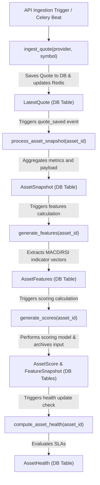

# Aureon Ingestion & Execution Graph

This document details the reactive background pipeline that processes ticker symbols from provider ingestion to feature calculation, evaluation scoring, and health updates.

## Graph Stages & Python Workers

1.  **Ingestion Stage**
    *   **Worker**: `ingest_quote(provider_name, symbol)` in [tasks.py](../../backend/app/workers/ingestion/tasks.py#L41)
    *   **Trigger**: Triggered via Celery task queue `q_ingestion`.
    *   **Action**: Fetches quote from provider adapter, updates `system.providers` status, saves to `market.latest_quotes` table, and triggers the `quote_saved` domain event.
2.  **Snapshot Stage**
    *   **Worker**: `process_asset_snapshot(asset_id)` in [asset_snapshot.py](../../backend/app/workers/snapshots/asset_snapshot.py#L8)
    *   **Trigger**: Invoked by the `quote_saved` event listener in [events.py](../../backend/app/domain/events.py#L8).
    *   **Action**: Compiles price and ratios into a market snapshot, upserts into the `market.asset_snapshot` table, caches in Redis, and chain-calls feature generation.
3.  **Feature Generation Stage**
    *   **Worker**: `generate_features(asset_id)` in [features.py](../../backend/app/workers/evaluation/features.py#L10)
    *   **Trigger**: Invoked upon successful compilation of the asset snapshot.
    *   **Action**: Performs range and outliers validation, upserts technical features into `market.asset_features`, caches in Redis, and chain-calls scoring.
4.  **Evaluation Stage**
    *   **Worker**: `generate_scores(asset_id)` in [scoring.py](../../backend/app/workers/evaluation/scoring.py#L11)
    *   **Trigger**: Invoked upon successful calculation of features.
    *   **Action**: Performs scoring logic, commits features input to `evaluation.feature_snapshots` table, upserts results to `evaluation.asset_scores`, caches in Redis, and chain-calls health checks.
5.  **Health Stage**
    *   **Worker**: `compute_asset_health(asset_id)` in [asset_health.py](../../backend/app/workers/monitoring/asset_health.py#L9)
    *   **Trigger**: Invoked upon successful evaluation scoring.
    *   **Action**: Evaluates quote age against SLA parameters, upserts health metrics into `market.asset_health` table, and caches in Redis.
